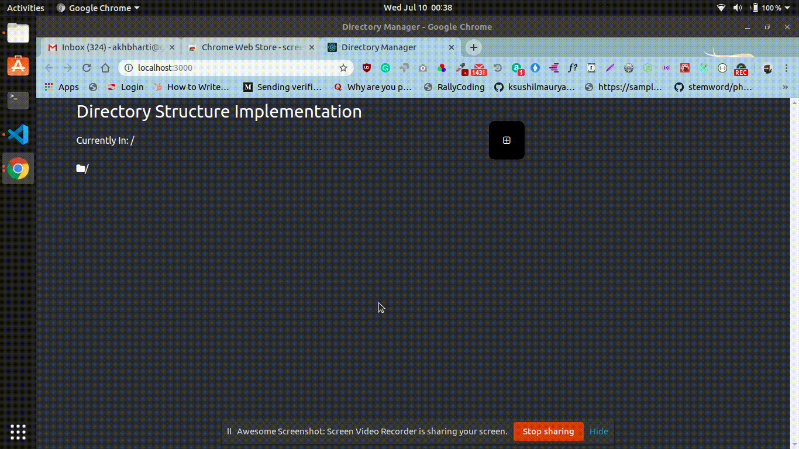

*** directory-Structure-Implementation
Problem Statement-Frontend app which will provide a desktop like
folder management environment, where you can create and traverse
between various directories and subdirectories

*** task completed-
1. New Directory can be created
2.User is able to move back directory
3. Redux is used to maintain the directory structure

*** To run the application

`npm install`

`npm start`

